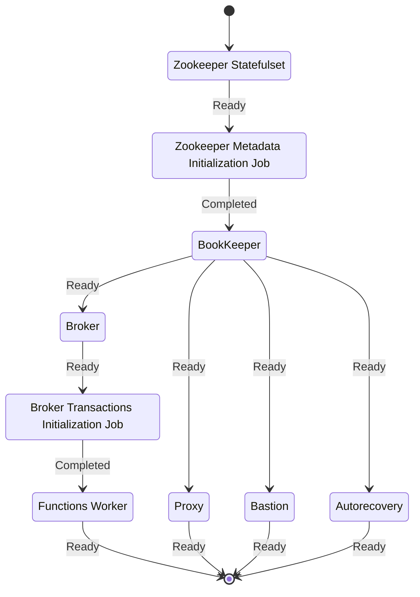

# Staged upgrades

The following chart shows how the operator handles each upgrade.

```mermaid
stateDiagram-v2
    zk: Zookeeper Statefulset
    zkinit: Zookeeper Metadata Initialization Job
    bk: BookKeeper
    broker: Broker
    brokertxn: Broker Transactions Initialization Job
    ar: Autorecovery
    proxy: Proxy
    ba: Bastion
    fn: Functions Worker
    [*] --> zk
    zk --> zkinit : Ready
    zkinit --> bk : Completed
    bk --> broker : Ready
    bk --> proxy : Ready
    bk --> ba : Ready
    bk --> ar : Ready
    broker --> brokertxn : Ready
    brokertxn --> fn : Completed
    fn --> [*] : Ready
    proxy --> [*] : Ready
    ba --> [*] : Ready
    ar --> [*] : Ready
```
   