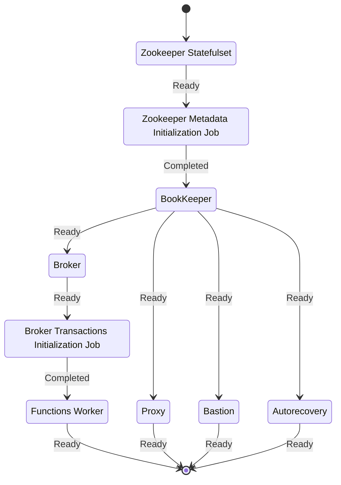

# Staged upgrades

The operator performs cluster upgrades in a very conservative manner.
The goal is to reduce the maintenance window time when doing an upgrade.

The operator follows a fixed schema to upgrade the cluster:

 
 
 Every component is updated (and then restarted) only if strictly needed.
 For example, if only the broker needs to be upgraded, then all the other services will be left up and running.
 
 In case of temporary errors or interruptions, the operator will try to apply the desired state specified in the `PulsarCluster` custom resource until it matches the actual state.
 
